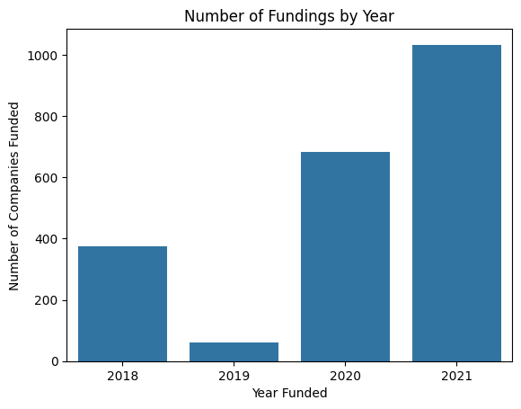
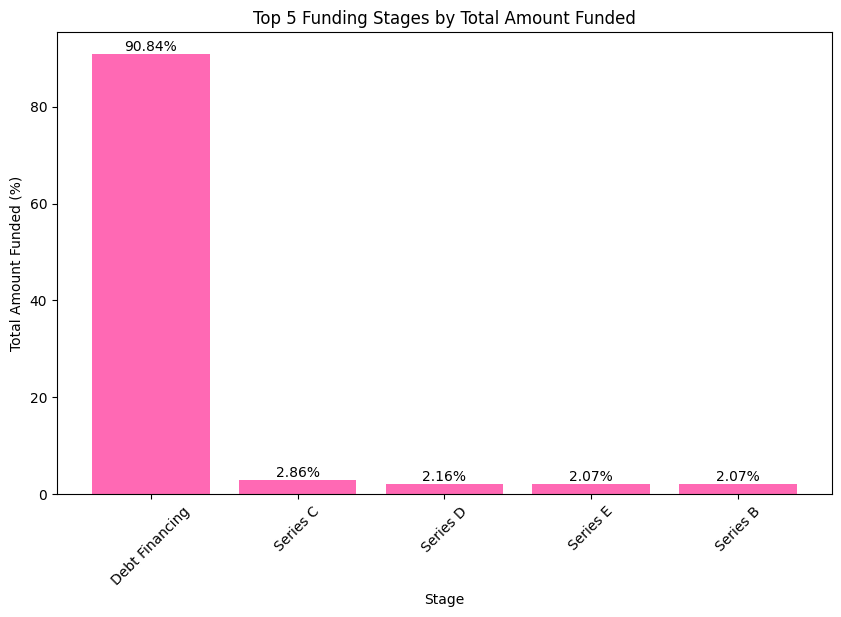

# A Data-Analysis Project

## Indian StartUp Funding Ecosystem
Start-up funding is vital for supporting new businesses that contribute to economic growth and technological progress. The Indian start-up ecosystem covers diverse areas including e-commerce, fintech, edtech, healthtech, and agritech.

This project seeks to provide the team with the knowledge and strategic insights needed to identify promising sectors, cities, funding trends, and key players. This will help them make informed decisions and effectively navigate the evolving Indian start-up environment.

### Project Description/Scenario
This project seeks to gain insight into the fundings received by start-ups companies in India between 2018 and 2021. And advice a team trying to venture into the Indian start-up ecosystem, by proposing the best course of action. This would be done by developing a unique story from this dataset, stating and testing a hypothesis, asking questions, perform analysis and share insights with relevant visualisations.

The Visualisations for the analyis are below

Top Five sectors with higher funding. 
Top cities with mist startups

Top five funding Types 
